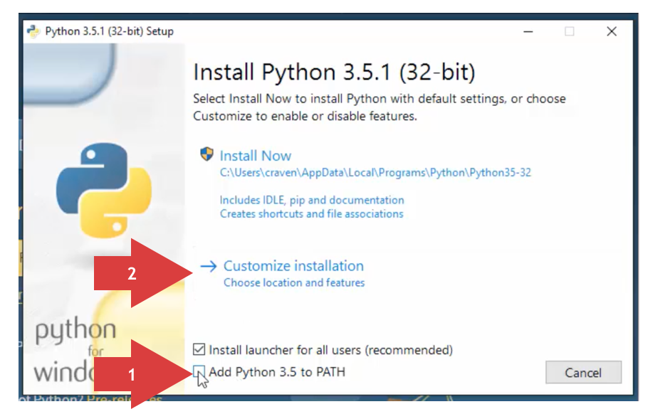
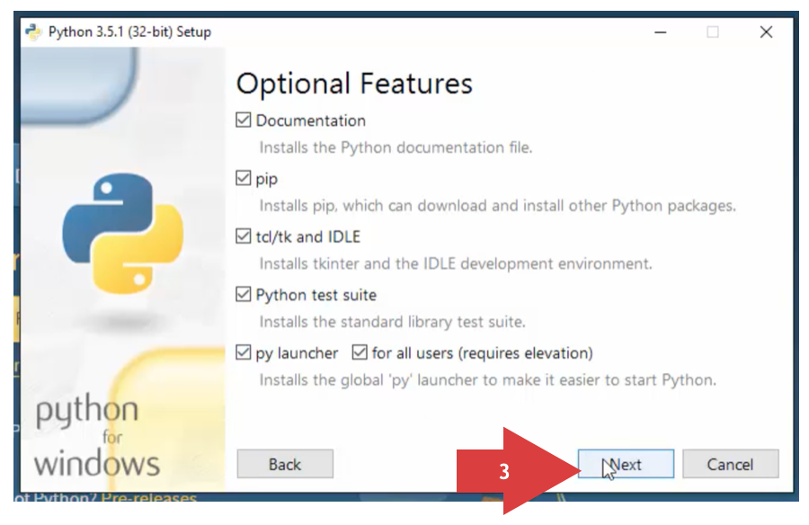
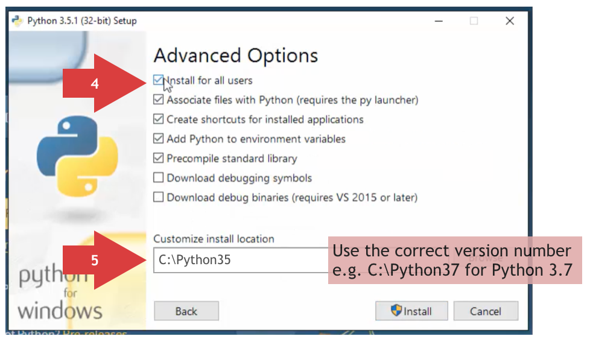

## Installing Python on Windows
The Python installer for Windows doesn't use the optimal default settings.
Follow these instructions when running the installer.
If you have already installed Python with the default settings,
follow the instructions here instead: [add Python to the PATH variable](WINSETPATH.md)

1. Check the *Add Python to PATH* box
2. Choose the *Customize installation* option
 

3. Keep the default settings and click *Next*
 

4. Check the *Install for all users* box if you want Python accessible by all users.
5. Customize the install location: **C:\Python37** or whatever version number you're installing
6. Click *Install*
 
